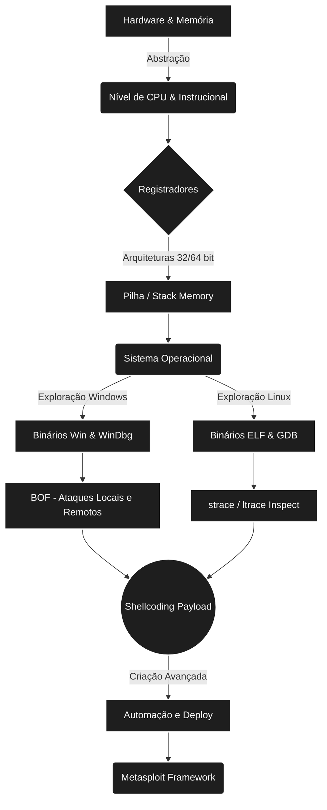

  

# 💻 FIAP 2026 - Computer Architecture, Memory, Assembly & Debuggers

  **Turma 1TDCPV - 1º e 2º Semestres**

  

    
    
    
  

  

    
    
    
    
    
  

---

## 📌 Visão Geral

Repositório dedicado à disciplina de **Computer Architecture**, ministrada na **FIAP** no ano de **2026** (Turma **1TDCPV**). O objetivo central desta matéria é proporcionar um entendimento profundo sobre o funcionamento da memória, registradores corporativos, binários, engenharia reversa e o desenvolvimento de exploits focados no conceito de **Buffer Overflow (BOF)**.

> **⚠️ Foco Principal do Ano:** `BUFFER OVERFLOW`

---

## 📢 Avisos Importantes da Disciplina

De acordo com as anotações do professor na aula inaugural, preste atenção nestes pontos chave:

- 🙋 **CHAMADA:** A presença é avaliada e fundamental.
- ✅ **Check Points (CPs):**
  - Valor: **10 pontos** cada.
  - A composição total será de **20 pontos** (teremos a regra em que **1 avaliação será descartada/ignorada**).
  - *Dica do Professor:* **FAÇAM OS CPs!** As avaliações serão avisadas com **7 dias de antecedência**.
- 🏆 **Global Solution (GS):**
  - Valor atribuído: **40 pontos**.
  - O prazo de aviso e organização também ocorrerá com **7 dias de antecedência**.
- 🤖 **Ferramentas Extras:** O uso do **GitHub Copilot** é abordado e integrado aos seus alertas, recomendando o uso responsável na trilha.

---

## 📅 Conteúdo Programático (Syllabus)

O curso está dividido estrategicamente em uma base **Teórica** (primeiro semestre), focada nos rudimentos arquiteturais do sistema, e numa etapa intensamente **Prática** (segundo semestre) focada no desenvolvimento e exploração do Buffer Overflow.

### 📚 1º Semestre: Foco Teórico e Base Arquitetural

| Semana | Tema Principal | Detalhamento |
| :---: | :--- | :--- |
| **01** | 🎯 Aula Inaugural | Apresentação do Professor, objetivos e plano de ensino. |
| **02** | 🧮 Arquitetura de Computadores | Base matemática (*Bits, Bytes, Hexadecimal*). |
| **03** | 🧠 Gerência de Memória | Tipos de Memória e os Modos de Operação da CPU. |
| **04** | 🗃️ Registradores | Características dos Registradores de **32 e 64 bits**. |
| **06-07** | 🖥️ Estrutura de Binários | Análise estruturada tanto para **Windows** quanto **Linux**. |
| **08** | 💻 Linguagem Assembly | Vislumbre e Introdução à Arquitetura e Linguagem **Assembly x86**. |
| **10** | 🐛 GNU Debugger | Conhecendo e utilizando o **GDB**. |
| **11** | 🔍 Rastreio e Inspeção | Utilização avançada de comandos como `ltrace` e `strace`. |
| **12** | 🥞 Organização da Pilha | Estrutura arquitetural e fluxo de execução da *Stack*. |
| **13** | 🐚 Shellcode (Linux) | Conceitos vitais na criação de payloads e Shellcodes. |
| **14** | 🛠️ Automação de Shellcode | Geração eficiente e otimizada por meio do **Metasploit**. |

*Observação: As Semanas 05, 09 e 15 são dedicadas à validação dos **Check Points**. Fim de semestre dedicado às Provas semestrais, vista de avaliações e substitutivas.*

### 💥 2º Semestre: Foco Prático (Buffer Overflow - BOF)

| Semana | Tema Principal | Exploração & Contenções |
| :---: | :--- | :--- |
| **01-02** | 🚨 Corrupção de Memória | Mecanismos gerais causadores do Buffer Overflow Clássico. |
| **03-04** | 🕹️ Controle de Fluxo | EIP, entendendo e manipulando o fluxo de execução do programa (**BOF Vanilla**). |
| **06-08** | 🪟 Exploração Local Windows | Introdução ao Windows Debugger e prática de BOF para acesso e exploração local. |
| **10-12** | 🌐 Exploração Remota Windows| BOF injetado via malhas de rede (Exploração Remota Extra incluída). |
| **13** | 🛡️ Proteções e Controles | Ferramentas de Defesa Definitivas: **NX/DEP, ASLR, Canaries/Stack Cookies**. |

---

## 🏗️ Diagrama de Tecnologias (Roadmap)

Abaixo está o mapeamento fluído e lógico conectando o nível de silício primário até a construção final do software e suas manipulações (Metasploit):

---

## 🛠️ Tecnologias Chave Envolvidas

Para o sucesso efetivo nesta jornada, o repositório abordará os seguintes componentes estruturais:

  
  
  
  
  
  
  
  
  

- **Assembly x86/x64**: Para entendimento detalhado sobre arquitetura de registradores e salto de instruções.
- **C/C++**: A linguagem basal do sistema, responsável por alocar os bytes na Stack possibilitando o ambiente de simulação e aprendizado para corrupção de memória.
- **Python**: Poderosa arma utilizada em *exploit scripts* rápidos para a injeção contínua de malwares de teste em portas de serviços ou de forma local.
- **GDB & Metasploit**: Ferramentas core dos analistas e góticos das profundezas do *Debugging*, guiadoras na injeção exata dos Endereços de Instruções.

---

> ✨ **Nota:** *Este `README.md` foi inteiramente personalizado mediante os requerimentos da disciplina e aos artefatos originais disponibilizados (`1TDCPV_anotado.pdf` e `ementa.png`). Feito para um acompanhamento dinâmico de classe.*
